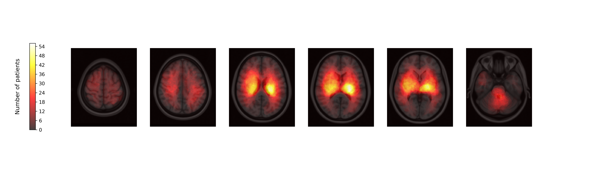

### Code for Atlas based Analysis and Traning of Segmentation Networks
Source Code for Figures and trainining of segmentation networks.

#### Registration of Toolbox Results to MMNI T1 1mm and 0.5mm

For the registration to the templates, enabling subsequent Atlas based lesion analysis, we are using FSL. Please make sure you have this installed.

To run the registration, make sure to specify the correct paths, and then run:

```
python3 flirt_co_register_and_warp.py --moving_template CT_template_1mm_not_registered.nii.gz --lesions /path/to/lesion_masks_folder --binary_mask threshZresults_testcentral_fever_binarized.nii.gz --threads 4 
```

#### Atlas based Analysis for Brainstem and Hypothalamus

To run the registration, make sure to specify the correct paths. All paths are taken from the default settings, this might not work in your setting.

```
python3 compute_atlas_overlap.py
```

#### VLSM Plot

```
python3 brain_lesion_map_one_row_legend_left.py --lesion_folder masks_warped_MNI_FSL_space/
```
